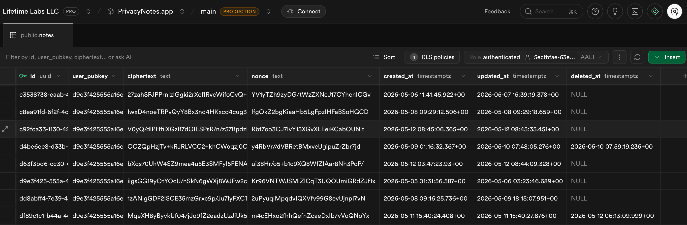

# PrivacyNotes - Open Core

PrivacyNotes is a zero-knowledge, end-to-end encrypted notes app. Your 12-word phrase is your identity and your key - no email or password required. Lose the phrase, lose your notes - by design.

The app is live at **[PrivacyNotes.app](https://privacynotes.app)**.

### What your data looks like on our server



A real row from the `notes` table. The server stores the public key, ciphertext, and nonce. That's it. No title, no body, no tags - just bytes we can't read.

---

## Why this repo exists

We believe privacy claims require proof. Saying "your notes are encrypted" means nothing if you can't read the code that does the encrypting.

This repository contains the **cryptographic core** and **database schema** of PrivacyNotes - the parts that matter for trust. You can read every line, audit every function, and verify that we do exactly what we say we do:

- Your phrase never leaves your device.
- Your notes are encrypted before they touch our server.
- The server stores only ciphertext it cannot read.

The application code (UI, editor, sync logic) is proprietary and lives in a private repository. This is sometimes called an **open core** model - the security-critical foundation is open, the product built on top of it is not.

---

## What's in this repo

### `SECURITY.md` - Threat model and cryptographic design

The authoritative description of what PrivacyNotes protects against, what it doesn't, the cryptographic design in full, the OAuth model, the PIN model, known limitations, and the audit roadmap. If you're reviewing the project, start there.

### `crypto/` - Cryptographic primitives

The single TypeScript module that handles all key derivation and encryption in PrivacyNotes. No wrappers, no indirection - this is the actual production code.

**Identity and key derivation:**

- A 12-word BIP-39 mnemonic (128 bits of entropy) is generated client-side
- The mnemonic is converted to a 64-byte seed via the standard BIP-39 PBKDF2 path
- Two keys are derived from that seed using HKDF-SHA256 with distinct domain-separation strings:
  - `privacynotes-signing-v1` - produces an Ed25519 private key; the corresponding public key becomes the user ID
  - `privacynotes-encryption-v1` - produces a 32-byte symmetric key for note encryption

**Note encryption:**

- Each note is encrypted with XChaCha20-Poly1305 using a random 24-byte nonce
- The plaintext payload includes title, body, tags, and metadata (trashed/starred state) - the server cannot see any of it
- 24-byte nonces make random generation safe without collision risk (unlike AES-GCM's 12-byte nonces)

**Challenge signing:**

- Pubkey-to-account binding uses Ed25519 signatures over structured challenge messages (`link:<authUid>`)
- Device registration and revocation use similar signed challenges
- All signatures bind to the session's auth UID to prevent replay attacks

**Dependencies (all from the [@noble](https://github.com/paulmillr/noble-hashes) and [@scure](https://github.com/paulmillr/scure-bip39) families by Paul Miller):**

- `@scure/bip39` - mnemonic generation and validation
- `@noble/hashes` - HKDF, SHA-256
- `@noble/ed25519` - signing keypair
- `@noble/ciphers` - XChaCha20-Poly1305

These libraries have zero dependencies, are written for auditability, and are used in production by major wallets and crypto projects.

### `schema/` - Database schema and row-level security

`schema/schema.sql` is the consolidated, current-state schema - the single file that defines every table, policy, trigger, and function in production. It proves:

- The server stores `ciphertext` and `nonce` - not plaintext
- Row-Level Security policies ensure each user can only access rows matching their own public key
- Abuse limits (per-pubkey note count, ciphertext size caps) are enforced server-side via triggers
- Note history (versioning) stores encrypted snapshots, not plaintext diffs
- Provisional anonymous accounts with no linked pubkey are purged after 30 days

---

## How to verify

### Read the code

The crypto module is a single file, under 300 lines, with inline comments explaining every step. Start there.

### Run it yourself

```bash
npm install @scure/bip39 @noble/hashes @noble/ed25519 @noble/ciphers

node -e "
const { generateMnemonic, mnemonicToSeedSync } = require('@scure/bip39');
const { wordlist } = require('@scure/bip39/wordlists/english');
const { hkdf } = require('@noble/hashes/hkdf');
const { sha256 } = require('@noble/hashes/sha256');

// Generate a phrase
const phrase = generateMnemonic(wordlist, 128);
console.log('Phrase:', phrase);

// Derive the seed
const seed = mnemonicToSeedSync(phrase);

// Derive encryption key (same path the app uses)
const encKey = hkdf(sha256, seed, undefined, 'privacynotes-encryption-v1', 32);
console.log('Encryption key (hex):', Buffer.from(encKey).toString('hex'));

// Same phrase always yields the same key
const seed2 = mnemonicToSeedSync(phrase);
const encKey2 = hkdf(sha256, seed2, undefined, 'privacynotes-encryption-v1', 32);
console.log('Deterministic:', Buffer.from(encKey).equals(Buffer.from(encKey2)));
"
```

### Inspect the database schema

Open `schema/schema.sql` - it's the complete, current-state schema with every table, RLS policy, trigger, and function. Look for the `notes` table: it stores `ciphertext` and `nonce`, not `title` or `body`.

### Compare against production

The cryptographic logic and constants in this repo match what ships in the app. The production bundle is minified, so an exact textual diff isn't practical - but the derivation paths are falsifiable. Inspect the JavaScript served at privacynotes.app and search the bundle for the literal strings `privacynotes-signing-v1` and `privacynotes-encryption-v1`, the HKDF-SHA256 construction, and the XChaCha20-Poly1305 cipher with 24-byte nonces. If any of those don't match `crypto/`, the claim is broken.

---

## Threat model

A short summary. The full threat model - trust boundaries, cryptographic detail, known limitations (AAD, sync conflicts, PIN as UX gate), and our position on third-party audits - lives in [`SECURITY.md`](SECURITY.md). If anything below disagrees with `SECURITY.md`, treat `SECURITY.md` as the authoritative version.

**What we protect against:**

- Server compromise - the database contains only ciphertext; an attacker who dumps every row gets nothing readable
- Network interception - encryption happens client-side before any data is transmitted
- Us - the server does not hold the keys required to decrypt your notes. Your phrase never reaches us.

**What the server still sees (metadata):**

End-to-end encryption protects content, not the fact that content exists. Even with every note encrypted, the server can observe:

- The public key associated with each row (your stable pseudonymous ID)
- Ciphertext length (an approximate signal of plaintext size)
- Row creation and update timestamps (activity patterns)
- Per-user note count and request IP addresses
- Sync frequency and access patterns

This is the same metadata-leakage profile as Signal, Standard Notes, and every other E2EE app of this shape. Tor or a VPN reduces the IP-level leak; the rest is structural to running a sync server at all.

**What we don't protect against:**

- Losing your phrase - there is no recovery mechanism. This is intentional.
- A compromised device - if malware is running on your machine, it can read what you can read
- Targeted browser exploits - the app runs in a browser; a sufficiently motivated attacker with access to your browser session could extract keys from memory
- Malicious JavaScript via web delivery - see the next section

**OAuth users (Google/Apple sign-in):** As of v0.152.0, OAuth users generate their recovery phrase on-device, the same way phrase-flow users do. The server cannot derive their phrase. OAuth provides identity and a way to recognize you on a new device - it is not a key recovery mechanism. If you sign in on a new device with Google or Apple, you'll still be asked to type your phrase or scan a QR sign-in code from an existing device.

OAuth is a trade-off: it gives you a familiar sign-in experience, but it also links your real-world identity (the email Google or Apple shares with us) to your public key in our database. Phrase-only users have no such linkage. If anonymity from us matters more than convenience, use the phrase flow. See `SECURITY.md` for the full OAuth section, including a note on what earlier versions did and why we changed it.

---

## Limits of browser-delivered cryptography

Open-sourcing the crypto module proves the design. It does not prove that the JavaScript your browser executed today is the JavaScript in this repo.

Because the web app at privacynotes.app is served dynamically, whoever controls our hosting infrastructure can ship modified JavaScript to a single user, a region, or everyone - at any time. A compromise of the infrastructure, a malicious insider, or external pressure on the hosting could in principle deliver a build that exfiltrates your phrase or your encryption key before you ever see ciphertext. Open-source crypto does not solve this; it is structural to every web-delivered app, not a flaw unique to us.

What narrows this gap today:

- **Source verification on each load.** The cryptographic constants and derivation paths are inspectable in the served bundle (see "Compare against production" above). An anomaly between the served code and this repo is detectable by anyone who looks.

What would close it structurally - and hasn't shipped yet:

- **Code-signed native builds.** A native desktop or mobile build ships as a fixed bundle whose hash users can verify before running it; a modified build would have to be re-signed and re-distributed, leaving a visible trail. We don't have these yet. We're calling it out as a known gap, not a future feature in disguise.

If your threat model is "the company is coerced or compromised tomorrow," current web-only delivery may not be sufficient for you. If it's "my notes shouldn't be readable by my hosting provider, my ISP, or our database operators," the encryption model holds and the web app is appropriate.

---

## What's NOT in this repo

The application itself: React UI, TipTap editor integration, sync engine, import/export, edge functions, build configuration, and deployment pipeline. These are proprietary.

---

## Security contact

If you find a vulnerability in the cryptographic implementation, please email **privacynotes@lifetimelabs.dev** instead of opening a public issue. Full reporting policy in [`SECURITY.md`](SECURITY.md).

---

## License

The contents of this repository are licensed under the **MIT License**. You are free to use, audit, fork, and build upon the cryptographic primitives and database schema published here.

The PrivacyNotes application (UI, sync engine, and all other proprietary components) is not covered by this license and remains proprietary.