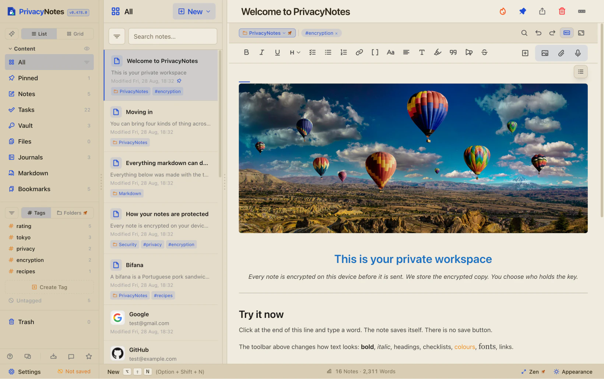
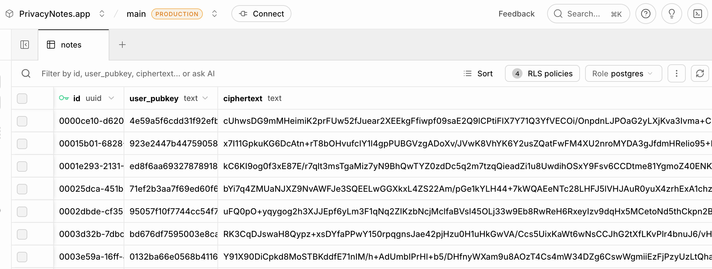

> [!IMPORTANT]
> **The apps are now open source.** As of August 31, 2026, the full client code for web, desktop and mobile is in [`application/`](application/), licensed under AGPL-3.0. If you came to check our claims, start with [VERIFY.md](VERIFY.md).

<div align="center">

<picture>
  <source media="(prefers-color-scheme: dark)" srcset="assets/logo-dark.svg">
  
</picture>
<br><br>

**End-to-end encrypted notes, tasks, and journal.**<br>
Your 12-word phrase is your identity and your key. No email, no password, no account to leak.

[**Website**](https://privacynotes.app/en) &nbsp;·&nbsp; [**Try it, no account**](https://try.privacynotes.app) &nbsp;·&nbsp; [**Verify it yourself**](VERIFY.md) &nbsp;·&nbsp; [**Security**](SECURITY.md) &nbsp;·&nbsp; [**Threat model**](THREAT_MODEL.md)

Signed apps for [**macOS**](https://privacynotes.app/en#downloads), [**Windows**](https://privacynotes.app/en#downloads), [**Linux**](https://privacynotes.app/en#downloads), [**Android**](https://privacynotes.app/en#downloads) and [**iOS**](https://apps.apple.com/app/id6785958812), or run it in the browser.

[](LICENSE)
[](crypto/crypto.ts)
[](crypto/crypto.ts)
[](#security-contact)
[](https://gitgem.org/github/LifetimeLabsDev/PrivacyNotes.app)

</div>

<br>

<div align="center">

<a href="https://try.privacynotes.app"></a>

<em>This screenshot is a link. It opens the <a href="https://try.privacynotes.app">live demo</a> in your browser:<br>
no account, nothing saved, the real app with the real encryption.</em>

</div>

<br>

<div align="center">

### What your data looks like on our server



<em>Real rows from the <code>notes</code> table in production. A public key, a ciphertext, a nonce.<br>
No title, no body, no tags. Just bytes we cannot read.</em>

<br>

**Do not take our word for it.** [**Check it yourself in about a minute**](VERIFY.md), with nothing but your browser's network tab.

</div>

<br>

---

## What PrivacyNotes is

An end-to-end encrypted notes, tasks and journal app for macOS, Windows, Linux, Android, iOS and the browser. You get a 12-word phrase instead of an account, and everything you write is encrypted on your device under a key only you hold, on disk and on the way to us. Notes, journal entries, tasks, a password vault, and file attachments all live under that one key.

---

## Why this repo exists

Privacy claims need proof. The parts you actually have to trust are here: the client applications, the cryptographic core, and the threat model - the real files that ship, not summaries. Reading `crypto.ts` proves the encryption is sound; having the client around it proves the encryption is used on every path.

Three claims we make, and where to check each one without taking our word for it:

| The claim | Check it here |
| :--- | :--- |
| Your phrase never leaves your device | [`crypto/crypto.ts`](crypto/crypto.ts), and the derivation strings in the live bundle |
| Notes are encrypted before they touch our server | [`crypto/crypto.ts`](crypto/crypto.ts), the XChaCha20-Poly1305 path |
| The server stores only ciphertext | [VERIFY.md](VERIFY.md) tier 1: watch your own notes leave in your browser's network tab |

If any of those stops holding, the claim is broken and you can prove it. That is the entire point of this repo.

The first claim has one exception, chosen at signup and off unless you pick it: [custodial mode](#custodial-mode-the-exception-to-the-first-claim).

---

## What is in here

| Path | What it is |
| :--- | :--- |
| [`application/`](application/) | The client applications, as we build them: the web app, the desktop and mobile shells, and the shared crypto package. `cd application && pnpm install && pnpm build`. |
| [`crypto/crypto.ts`](crypto/crypto.ts) | Key derivation and note encryption, about 560 lines, commented step by step. Not a reference implementation. The production code, copied here so the link is short; the canonical file is `application/packages/shared/src/crypto.ts`. Attachments and images use the same cipher through [`crypto/blob.ts`](crypto/blob.ts), which is another 50 lines. |
| [`SECURITY.md`](SECURITY.md) | What we protect against, what we do not, and what the server can see. Written for users. |
| [`THREAT_MODEL.md`](THREAT_MODEL.md) | Trust boundaries, cryptographic detail, and known limitations, including the unflattering ones. Written for auditors. **Start here if you are reviewing the project.** |

### The design in brief

**Identity and key derivation.** A 12-word BIP-39 mnemonic (128 bits of entropy) is generated on your device and turned into a 64-byte seed via the standard BIP-39 PBKDF2 path. Every key comes out of that seed via HKDF-SHA256, each under its own domain-separated info string so that no two uses share key material:

| Info string | Produces | Used for |
| :--- | :--- | :--- |
| `privacynotes-signing-v1` | Ed25519 private key | Its public key is your user ID |
| `privacynotes-encryption-v1` | 32-byte symmetric key | Note, attachment and image encryption |
| `privacynotes-local-at-rest-v1` | 32-byte symmetric key | Seals note content at rest in the device's own storage; never stored, never transmitted |
| `privacynotes-auth-password-v1` | 32-byte secret | The password for the anonymous account that carries your session |
| `privacynotes-fp-pepper-v1` | 32-byte pepper | Hashes the device-grouping signals described in SECURITY.md, so the server never sees the raw values |

**Note encryption.** Each note is encrypted with XChaCha20-Poly1305 under a random 24-byte nonce. The plaintext payload includes title, body, tags, and metadata such as trashed and starred state. The server sees none of it. The 24-byte nonce is what makes random generation safe without collision risk, unlike AES-GCM's 12 bytes.

**Challenge signing.** Pubkey-to-account binding uses Ed25519 signatures over structured challenges (`link:<authUid>`). Device registration and revocation use the same shape. Every signature binds to the session's auth UID, so a captured signature cannot be replayed into another session.

**Dependencies**, all from the [@noble](https://github.com/paulmillr/noble-hashes) and [@scure](https://github.com/paulmillr/scure-bip39) families: `@scure/bip39`, `@noble/hashes`, `@noble/ed25519`, `@noble/ciphers`. Zero dependencies each, written to be auditable, deployed in production by major wallets.

---

## Verify it yourself

**Read it.** [`crypto/crypto.ts`](crypto/crypto.ts) is one file and you can finish it in a sitting.

**Run the derivation.** The same path the app uses, from the same audited packages, in a scratch directory you can delete afterwards. Copy the whole block:

```bash
mkdir -p /tmp/pn-verify && cd /tmp/pn-verify
npm install --silent @scure/bip39@^2 @noble/hashes@^2

node --input-type=module -e "
import { generateMnemonic, mnemonicToSeedSync } from '@scure/bip39';
import { wordlist } from '@scure/bip39/wordlists/english.js';
import { hkdf } from '@noble/hashes/hkdf.js';
import { sha256 } from '@noble/hashes/sha2.js';

const utf8 = new TextEncoder();
const hex  = b => Buffer.from(b).toString('hex');

const phrase = generateMnemonic(wordlist, 128);
const seed   = mnemonicToSeedSync(phrase);
const encKey = hkdf(sha256, seed, undefined, utf8.encode('privacynotes-encryption-v1'), 32);
const sigKey = hkdf(sha256, seed, undefined, utf8.encode('privacynotes-signing-v1'), 32);

console.log('Phrase           :', phrase);
console.log('Encryption key   :', hex(encKey));
console.log('Signing key      :', hex(sigKey));
console.log('Deterministic    :', hex(hkdf(sha256, mnemonicToSeedSync(phrase), undefined, utf8.encode('privacynotes-encryption-v1'), 32)) === hex(encKey));
console.log('Domain-separated :', hex(encKey) !== hex(sigKey));
"
```

Two lines of that output are the ones that matter. `Deterministic: true` says the phrase alone reproduces the key, on any machine, forever, with nothing fetched from us. `Domain-separated: true` says the signing key and the encryption key cannot be derived from each other, so publishing your user ID does not leak the key your notes are under.

**Diff it against production.** The bundle is minified, so a textual diff is not practical, but the derivation is falsifiable anyway. Open the JavaScript served at PrivacyNotes.app and search it for `privacynotes-signing-v1` and `privacynotes-encryption-v1`, the HKDF-SHA256 construction, and XChaCha20-Poly1305 with 24-byte nonces. They are in there right now. If they ever are not, we are lying and you can show it.

**Watch the wire.** The strongest check needs no source at all. Open your browser's network tab, type a word into a note, and read what the app sends: a ciphertext, a nonce, a public key and timestamps. No title, no body, nothing you typed. [VERIFY.md](VERIFY.md) walks it in about a minute. It beats reading our table definitions, because it measures what actually leaves your machine rather than what we say we store.

---

## The parts that are not absolute

Every honest end-to-end encrypted project has these. Here are ours.

### Custodial mode, the exception to the first claim

By default your phrase never leaves your device. At OAuth signup (Google, Apple or GitHub) you can instead ask us to store it, so a new device is one click instead of twelve words. Pick that and the phrase sits on our servers encrypted under a key WE hold: a valid legal order, a deep enough compromise, or a dishonest future version of us could reach your plaintext. We count capabilities, not intentions, and that capability is on our side. Self-custody users are exposed to none of it.

The choice is reversible either way from Settings > Security > Your Phrase, both directions signed with your own account key. [SECURITY.md](SECURITY.md) is the full statement of what each mode protects and what it does not. If you want the version of PrivacyNotes this document describes, use the phrase flow.

### Metadata

Encryption protects content, not the fact that content exists. Even with every note encrypted, the server sees your public key (a stable pseudonymous ID), ciphertext length, row timestamps, note counts, request IPs, and sync patterns. This is structural to running a sync server and it is the same shape of leak every app of this kind has. Tor or a VPN handles the IP part. The rest is the cost of sync.

### OAuth attaches a name to your key

Sign in with Google, Apple or GitHub and the email the provider shares with us is linked to your pubkey, custodial or not. Phrase-only users have no such link.

### Browser-delivered code

Published source does not prove that the JavaScript your browser ran today came from it: anyone controlling our hosting could serve modified code, per user or per region. That is structural to every web app. What narrows it: the signed native builds (macOS notarized, Windows Authenticode, Linux signed AppImage, Android certificate-pinned APK) are fixed artifacts that cannot change under you between visits - **if your threat model includes us being coerced, prefer them** - and the derivation constants stay findable in the served bundle, as above. Subresource Integrity and reproducible web builds have not shipped yet.

### Things we cannot help with

Losing your phrase, under self-custody, means losing your notes. There is no reset, because a reset is a backdoor with better branding. Malware on your device reads what you read. A targeted attacker with your unlocked browser session can reach your keys in memory.

---

## Coming from another app

The importer already reads your export:

| Coming from | What to drop in |
| :--- | :--- |
| [Evernote](https://privacynotes.app/help/import/evernote) | `.enex`, on its own or several zipped. Keeps formatting, tags, attachments, note links and notebooks |
| [Apple Notes](https://privacynotes.app/help/import/apple-notes) | `.zip` of a Markdown export |
| [Apple Journal](https://privacynotes.app/help/import/apple-journal) | `.zip` of `AppleJournalEntries`, with photos, videos, voice memos and locations |
| [Obsidian](https://privacynotes.app/help/import/obsidian) | vault `.zip`, keeping tags, `[[note links]]` and folder structure |
| [Notesnook](https://privacynotes.app/help/import/notesnook) | `.zip` HTML export or `.nnbackupz` |
| [Standard Notes](https://privacynotes.app/help/import/standard-notes) | `.zip` or `.txt` backup |
| [Simplenote](https://privacynotes.app/help/import/simplenote) | `.zip` or `.json` export |
| [Google Keep](https://privacynotes.app/help/import/google-keep) | Takeout `.zip` or `.json` |
| [Samsung Notes](https://privacynotes.app/help/import/samsung-notes) | `.zip`, `.docx` or `.txt` |
| [UpNote](https://privacynotes.app/help/import/upnote) | `.zip` export |
| [Nextcloud Notes](https://privacynotes.app/help/import/nextcloud-notes) | `.zip` of the notes folder from your server |
| [iA Writer](https://privacynotes.app/help/import/ia-writer) | `.zip` of the library, or the `.md` files |
| [Typora](https://privacynotes.app/help/import/typora) | the `.md` files, individually or zipped |
| [Zettlr](https://privacynotes.app/help/import/zettlr) | `.zip` of the workspace folder |
| [Bitwarden](https://privacynotes.app/help/import/bitwarden) | `.json` export, into the password vault |
| [Browser passwords](https://privacynotes.app/help/import/browser-passwords) | `.csv` export from Chrome, Firefox, Safari or Edge, into the password vault |
| [Browser bookmarks](https://privacynotes.app/help/import/browser-bookmarks) | the exported `.html` bookmarks file |
| [Anything else](https://privacynotes.app/help/import/markdown) | `.md` files, individually or zipped |

Nothing in that list is uploaded for conversion. The parser runs in your browser and the result is encrypted on the device, which is the only reason importing a decade of Evernote into a service like this is a reasonable thing to do.

---

## Security contact

Found a flaw in the crypto, the derivation, or the client? Email **privacynotes@lifetimelabs.dev** rather than opening a public issue, so it can be fixed before it is public.

That address is published in our PGP-signed [security.txt](https://privacynotes.app/.well-known/security.txt) so you can confirm it is really us, and our [public key](https://privacynotes.app/.well-known/pgp-key.txt) is there if you want to encrypt the report. If a fix needs coordination we will work with you on timing before disclosure. There is no paid bounty program yet.

**No third-party audit has been performed yet.** The first serious spend out of revenue is one, with Cure53 as the target firm.

---

## License

This repository is **AGPL-3.0**. Read it, audit it, build it, fork it. If you run a modified version as a network service, publish your changes.

The name PrivacyNotes, the wordmark and the icon are not part of that grant. A fork needs its own name.


Writing about PrivacyNotes? The square app icon is [`assets/icon.svg`](assets/icon.svg), and the full brand kit, with lockups and usage rules, is at [privacynotes.app/brand](https://privacynotes.app/brand). [NOTICE.md](NOTICE.md) says what the license grant does not cover.

A note on the earlier MIT releases of the encryption files is in [`crypto/README.md`](crypto/README.md).
