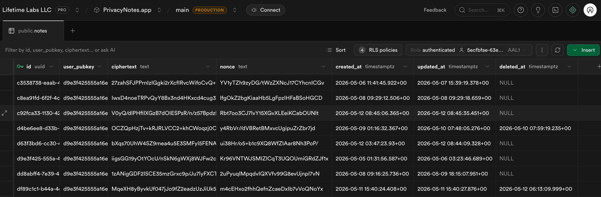

<div align="center">


# PrivacyNotes

**End-to-end encrypted notes, tasks, and journal.**<br>
Your 12-word phrase is your identity and your key. No email, no password, no account to leak.

[**Website**](https://privacynotes.app) &nbsp;·&nbsp; [**Try it, no account**](https://try.privacynotes.app) &nbsp;·&nbsp; [**Security**](SECURITY.md) &nbsp;·&nbsp; [**Threat model**](THREAT_MODEL.md)

[](LICENSE)
[](crypto/crypto.ts)
[](crypto/crypto.ts)
[](#security-contact)
[](https://gitgem.org/github/LifetimeLabsDev/PrivacyNotes.app)

</div>

<br>

<div align="center">

### What your data looks like on our server



<em>A real row from the <code>notes</code> table. A public key, a ciphertext, a nonce.<br>
No title, no body, no tags. Just bytes we cannot read.</em>

</div>

<br>

---

## Why this repo exists

Privacy claims need proof. "Your notes are encrypted" means nothing if you cannot read the code doing the encrypting.

So the parts you actually have to trust are here: the cryptographic core, the database schema, and the threat model. Not summaries of them. The real files, the ones that ship.

Three claims we make, and where to check each one without taking our word for it:

| The claim | Check it here |
| :--- | :--- |
| Your phrase never leaves your device | [`crypto/crypto.ts`](crypto/crypto.ts), and the derivation strings in the live bundle |
| Notes are encrypted before they touch our server | [`crypto/crypto.ts`](crypto/crypto.ts), the XChaCha20-Poly1305 path |
| The server stores only ciphertext | [`schema/schema.sql`](schema/schema.sql), the `notes` table and its RLS policies |

If any of those stops holding, the claim is broken and you can prove it. That is the entire point of this repo.

The first claim has one exception, which you choose at signup and which is off unless you pick it. We would rather you read about it here than find it yourself: see [custodial mode](#custodial-mode-the-exception-to-the-first-claim).

---

## What is in here

| Path | What it is |
| :--- | :--- |
| [`crypto/crypto.ts`](crypto/crypto.ts) | Every line of key derivation and encryption in PrivacyNotes. One file, about 400 lines, commented step by step. Not a reference implementation. The production code. |
| [`schema/schema.sql`](schema/schema.sql) | The consolidated current-state schema. Every table, RLS policy, trigger, and function in production. |
| [`SECURITY.md`](SECURITY.md) | What we protect against, what we do not, and what the server can see. Written for users. |
| [`THREAT_MODEL.md`](THREAT_MODEL.md) | Trust boundaries, cryptographic detail, and known limitations, including the unflattering ones. Written for auditors. **Start here if you are reviewing the project.** |

### The design in brief

**Identity and key derivation.** A 12-word BIP-39 mnemonic (128 bits of entropy) is generated on your device and turned into a 64-byte seed via the standard BIP-39 PBKDF2 path. Two keys come out of that seed via HKDF-SHA256, with domain-separated info strings:

| Info string | Produces | Used for |
| :--- | :--- | :--- |
| `privacynotes-signing-v1` | Ed25519 private key | Its public key is your user ID |
| `privacynotes-encryption-v1` | 32-byte symmetric key | Note encryption |

**Note encryption.** Each note is encrypted with XChaCha20-Poly1305 under a random 24-byte nonce. The plaintext payload includes title, body, tags, and metadata such as trashed and starred state. The server sees none of it. The 24-byte nonce is what makes random generation safe without collision risk, unlike AES-GCM's 12 bytes.

**Challenge signing.** Pubkey-to-account binding uses Ed25519 signatures over structured challenges (`link:<authUid>`). Device registration and revocation use the same shape. Every signature binds to the session's auth UID, so a captured signature cannot be replayed into another session.

**Dependencies**, all from the [@noble](https://github.com/paulmillr/noble-hashes) and [@scure](https://github.com/paulmillr/scure-bip39) families: `@scure/bip39`, `@noble/hashes`, `@noble/ed25519`, `@noble/ciphers`. Zero dependencies each, written to be auditable, deployed in production by major wallets.

---

## Verify it yourself

**Read it.** [`crypto/crypto.ts`](crypto/crypto.ts) is one file and you can finish it in a sitting.

**Run the derivation.** The same path the app uses:

```bash
npm install @scure/bip39 @noble/hashes @noble/ed25519 @noble/ciphers

node -e "
const { generateMnemonic, mnemonicToSeedSync } = require('@scure/bip39');
const { wordlist } = require('@scure/bip39/wordlists/english');
const { hkdf } = require('@noble/hashes/hkdf');
const { sha256 } = require('@noble/hashes/sha256');

const phrase = generateMnemonic(wordlist, 128);
console.log('Phrase:', phrase);

const seed = mnemonicToSeedSync(phrase);
const encKey = hkdf(sha256, seed, undefined, 'privacynotes-encryption-v1', 32);
console.log('Encryption key (hex):', Buffer.from(encKey).toString('hex'));

const encKey2 = hkdf(sha256, mnemonicToSeedSync(phrase), undefined, 'privacynotes-encryption-v1', 32);
console.log('Deterministic:', Buffer.from(encKey).equals(Buffer.from(encKey2)));
"
```

**Diff it against production.** The bundle is minified, so a textual diff is not practical, but the derivation is falsifiable anyway. Open the JavaScript served at privacynotes.app and search it for `privacynotes-signing-v1` and `privacynotes-encryption-v1`, the HKDF-SHA256 construction, and XChaCha20-Poly1305 with 24-byte nonces. They are in there right now. If they ever are not, we are lying and you can show it.

**Read the schema.** In [`schema/schema.sql`](schema/schema.sql), find the `notes` table. It has `ciphertext` and `nonce`. It has no `title` and no `body`. RLS restricts every row to the public key that owns it, and abuse limits (note count, ciphertext size) are enforced by triggers rather than by asking nicely. Abandoned signups that never link a pubkey are purged after 7 days; accounts that finished setup are never deleted for inactivity.

---

## The parts that are not absolute

Every honest end-to-end encrypted project has these. Here are ours.

### Custodial mode, the exception to the first claim

By default your phrase is generated on your device and never sent anywhere. That is self-custody, and it is what you get unless you decide otherwise.

When you sign up with Google or Apple, you choose between self-custody and letting us store your phrase so that signing in on a new device is one click instead of twelve words. If you pick the second, the truth is short: **we can decrypt your notes.** Your phrase sits on our servers encrypted under a key we hold, so a valid legal order, a deep enough compromise, or a dishonest future version of us could reach your plaintext. Self-custody users are exposed to none of that, because there is nothing on our side to compel.

It is a one-way ratchet. You can move from custodial to self-custody whenever you want and we delete our copy. You cannot go back.

We think the trade is legitimate, because for many people the realistic alternative is not a stricter notes app, it is a plaintext one. But it is a real trade and it belongs in the README rather than a footnote. If you want the version of PrivacyNotes this document describes, use the phrase flow.

[`SECURITY.md`](SECURITY.md) and [`THREAT_MODEL.md`](THREAT_MODEL.md) carry the full detail, including a weakness in custodial phrase retrieval that we have flagged for audit rather than quietly fixed and forgotten.

### Metadata

Encryption protects content, not the fact that content exists. Even with every note encrypted, the server sees your public key (a stable pseudonymous ID), ciphertext length, row timestamps, note counts, request IPs, and sync patterns. This is structural to running a sync server and it is the same shape of leak every app of this kind has. Tor or a VPN handles the IP part. The rest is the cost of sync.

### OAuth attaches a name to your key

Phrase-only users have no identity attached to their public key. Sign in with Google or Apple and the email the provider shares with us is linked to your pubkey in our database. This is true whether or not you choose custodial mode. If being unidentifiable to us matters more than convenience, use the phrase flow.

### Browser-delivered code

Open-sourcing the crypto proves the design. It does not prove that the JavaScript your browser ran today is the JavaScript in this repo. Anyone controlling our hosting could serve modified code to one user, one region, or everyone. This is structural to every web app, it is not unique to us, and open source alone does not fix it.

What narrows it today:

- **Signed native builds.** macOS is notarized, Windows is Authenticode-signed through Azure, Linux ships a signed AppImage and deb, and the Android APK is pinned to a certificate we cannot rotate without every sideloaded user's app refusing the update. A native build is a fixed artifact rather than code refetched on every load, so tampering means re-signing and re-distributing, which leaves a trail. **If your threat model includes us being coerced, prefer the native apps.**
- **Inspectable constants on every load.** The derivation paths are visible in the served bundle, as above.

What would close it further and has not shipped: Subresource Integrity and reproducible web builds. We would rather name the gap than let it sit quietly.

### Things we cannot help with

Losing your phrase, under self-custody, means losing your notes. There is no reset, because a reset is a backdoor with better branding. Malware on your device reads what you read. A targeted attacker with your unlocked browser session can reach your keys in memory.

---

## What is not in here

The application: React UI, the editor, the sync engine, import and export, edge functions, and the build pipeline.

We have committed to open-sourcing the client apps once the native apps have all shipped. The sync backend stays closed, so that will not make PrivacyNotes an open-source project in the unqualified sense, and we would rather say so than let the phrase do work it has not earned. Until then: open-source clients are the plan, an open core is the present tense.

---

## Security contact

Found a flaw in the crypto, the derivation, or the schema? Email **privacynotes@lifetimelabs.dev** rather than opening a public issue, so it can be fixed before it is public.

That address is published in our PGP-signed [security.txt](https://privacynotes.app/.well-known/security.txt) so you can confirm it is really us, and our [public key](https://privacynotes.app/.well-known/pgp-key.txt) is there if you want to encrypt the report. If a fix needs coordination we will work with you on timing before disclosure. There is no paid bounty yet; we want one when it is responsibly affordable.

**No third-party audit has been performed.** The first serious spend out of revenue is one, with Cure53 as the target firm. We would rather write that sentence than gesture at "audit coming soon."

---

## License

This repository is **MIT**. Use it, audit it, fork it, build on it.

The PrivacyNotes application is not covered by this license.
