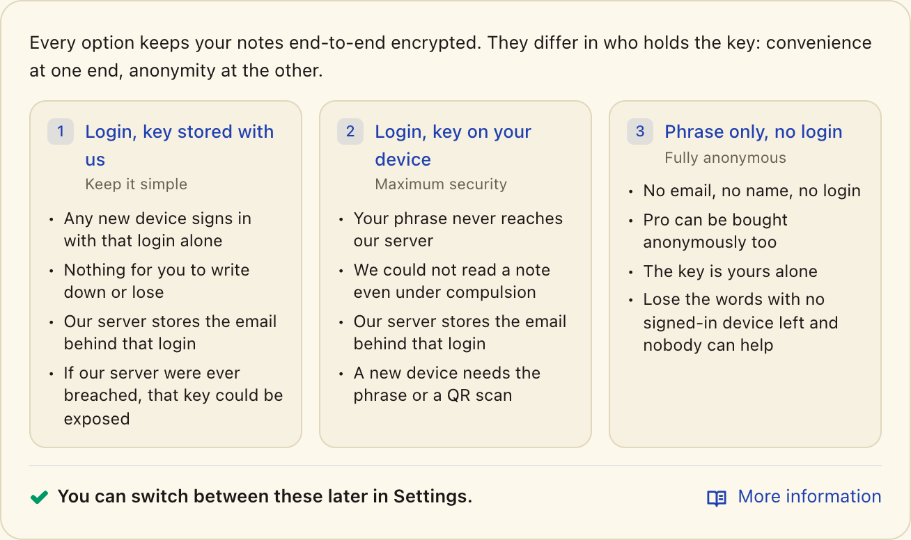

# Security

This document describes how PrivacyNotes handles your data, what we protect against, and what we don't. It's written for users who want to know what they're trusting, and for anyone reviewing the project.

If you find a vulnerability, please email privacynotes@lifetimelabs.dev instead of opening a public issue.

## In one paragraph

PrivacyNotes is end-to-end encrypted. Your 12-word recovery phrase is generated on your device. From it we derive two keys: one to encrypt every note, task, and journal entry before it leaves the device, and one to sign requests so the server can tell it's you without knowing who you are. The server stores ciphertext and a public key. Under self-custody, which is the default, the keys that decrypt your data live only on your devices. You do not have to take that on faith: [VERIFY.md](VERIFY.md) shows you how to check it in about a minute, in your browser's network tab.

One deliberate exception exists, chosen at signup: **custodial mode**, where we store your phrase so a new device is one click. It moves the ability to decrypt your notes to our side, and it has [its own section below](#oauth-and-custodial-mode).

## What the server sees

The server is Supabase (Postgres + Row Level Security) in Zurich. For each user it stores:

- A public Ed25519 key, which acts as the account identifier.
- Encrypted blobs of notes, tasks, journal entries, settings, and version history.
- Nonces and timestamps required to sync and resolve order.
- Sizes of the encrypted blobs (a row in a database has a size).

It does not store: titles, body text, tags, or anything derived from them. Phrase-flow users sign up with anonymous Supabase auth - no email, no name, no identifier tied to who they are. OAuth users (Google, Apple) have an identity from the provider attached to their session; see the OAuth section below for what that does and does not mean.

It does not store your recovery phrase either, unless you chose custodial mode. If the server is compromised tomorrow, the attacker gets opaque bytes addressed by public key: they can see which key syncs when and roughly how many notes it holds, and they cannot read content. Custodial users are the exception, because an attacker who reached both the database and the phrase-encryption key could decrypt their notes.

## Cryptography

The phrase becomes a BIP-39 seed, and HKDF-SHA256 with domain-separated info strings derives an Ed25519 signing key and a 256-bit XChaCha20-Poly1305 content key from it. Fresh random 24-byte nonces on every write; Ed25519 signatures over session-bound challenges authenticate sensitive operations. All primitives come from the audited noble/scure libraries by Paul Miller. The full derivation diagram, the parameter choices, and the known limitations (including that ciphertexts carry no AAD binding to their row) are in [THREAT_MODEL.md](THREAT_MODEL.md), which is the canonical cryptographic reference.

## PIN protection

The optional 4-digit PIN is a UI gate, not a cryptographic boundary: it stops someone glancing at your screen, not someone with the stored hash and offline compute, who brute-forces 10,000 values in minutes to hours regardless of our 600,000 PBKDF2 iterations. Locked and PIN-protected notes are gated by the client, not separately encrypted, because a second PIN-derived key would make them unrecoverable on a forgotten PIN. What actually protects data on your machine is OS disk encryption and your screen lock. Implementation detail and lockout behavior are in [THREAT_MODEL.md](THREAT_MODEL.md).

## Sync

Pull-then-push per device. Concurrent edits to the same note are detected, metadata-only changes merge automatically, and body conflicts surface a resolution dialog with both versions preserved. Deleting a note writes a tombstone that syncs to your other devices; the server permanently removes tombstoned rows and their version history after 30 days, and until then the note is restorable.

## What we measure

The server-side data we hold beyond ciphertext and the pubkey identifier:

- **Device records**, one per registered device per account. Stores `device_id`, a `device_name` your device builds from its own platform and OS name ("macOS", "iOS app", "Desktop app on Windows"), a coarse `platform` label (`web` / `desktop` / `ios` / `android`), `created_at`, `last_seen_at`, an optional `revoked_at`, and a `device_group` identifier we use to keep multiple browser installs on the same physical machine within one slot.
- **Device-grouping hashes**, four per device: HMAC-SHA256 of coarse environment signals (OS family, WebGL renderer, CPU cores, language), computed on your device under a pepper derived from your phrase. They exist to keep several browsers on one machine inside one free-tier device slot. The server never sees the raw values, cannot reverse the hashes without the pepper, and cannot correlate a device across accounts, because the pepper is per-user. Hardened browsers can shift the signals and cost you a slot temporarily, never access.
- **Per-account quotas**: counters for the number of notes, total ciphertext bytes, and image bytes you currently hold. Used to enforce free vs. Pro storage caps. Derived from the data you've stored, not from anything you've told us about yourself.
- **Subscription records** if you've bought Pro or extra storage through Paddle. Includes a payment provider subscription id and your pubkey. Email and billing details are held by Paddle as Merchant of Record, not by us.
- **Import and export counts**: one row per flow, carrying the flow name (`obsidian`, `vault`, `pdf`) and a timestamp. No pubkey, no user id, nothing linking a row to a person or another row: a count of events, not a record about anyone. We read it to see which importers earn their maintenance.
- **Website-icon lookups**, which are requests rather than stored records. With site icons on, the app asks our own edge for an icon and the domain sits in that request URL; the Worker has no request logging, no analytics binding and no log export, so nothing is written down at our end. The icon cache is shared and carries no account or device id. Settings > Appearance turns it off. It is the one thing you typed that leaves your device readable, and [VERIFY.md](VERIFY.md) names it too.
- **Aggregate operator dashboards**: signups per day, retention cohorts, totals, platform breakdown. All computed in-database from the records above.

What we explicitly do not collect or persist on accounts: user-agent strings, geolocation, behavioral telemetry, analytics events tied to note content, or anything that lets us reach you outside the app.

**Third-party JavaScript, stated exactly.** We run no analytics, advertising or tracking scripts, and none load on an ordinary session. Two third-party scripts do load, each only in a named circumstance, and both on the web app rather than the desktop and mobile builds:

- **Cloudflare Turnstile**, from `challenges.cloudflare.com`, and only when the server asks for a challenge during sign-up or sign-in. It is a bot check. Nothing loads it until there is something to solve.
- **Paddle's checkout script**, from `cdn.paddle.com` (and `sandbox-cdn.paddle.com`, its test equivalent, which a released build never calls). Paddle is our Merchant of Record. When Paddle's Retain feature is active on our account, Paddle's own script in turn loads `public.profitwell.com`, which is subscription analytics belonging to Paddle rather than to us.

  **This one never runs in the app.** Starting a purchase opens our checkout page on `privacynotes.app`, a different origin from the app on `use.privacynotes.app`, and Paddle's script loads there. A different origin cannot read the app's stored data, so no payment code shares a page with your phrase or your keys. The desktop and mobile apps have always worked this way; the web app joined them in v0.474.3. **And the policy now says so.** Paddle is allowlisted on exactly one page, `/checkout`, and on nothing else. Check it yourself, and note that these are two different answers from the same server:

  ```
  curl -sI https://use.privacynotes.app | grep -i content-security-policy   # no paddle, no profitwell
  curl -sI https://privacynotes.app/checkout | grep -i content-security-policy   # paddle
  ```

  The app you keep your notes in cannot load a payment script at all, because the policy it is served under does not name one. That is a stronger statement than the promise above it, and it is the one worth checking.

On IP addresses: Cloudflare and Supabase transiently process them at the network layer for routing and abuse prevention, and our rate limits use them. We do not write IPs into user records or associate them with content.

## OAuth and custodial mode

[](https://privacynotes.app/help/threat-model-levels)

Signing in with Google, Apple or GitHub is a convenience entry point: your phrase is still generated on your device. The cost, whichever mode you pick, is that the email the provider shares with us is linked to your public key. Phrase-only users have no such link; if being unidentifiable to us matters more than a fast sign-in, use the phrase flow.

At OAuth signup you choose the most consequential setting in the product. **Self-custody** (the default): your phrase never leaves your device, and a new device needs the phrase or a QR sign-in from one you already use. **Custodial**: we keep a copy of your phrase, encrypted with AES-256-GCM under a key the server holds, so a new device is one click.

**Custodial mode means the capability to decrypt your notes sits on our side.** We do not use it, and nothing in our systems reads note content - but intentions are not auditable, and they survive neither a subpoena nor a change of ownership, so count the capability: a valid legal order could produce your plaintext, and so could a deep enough compromise of our server, or a dishonest future version of this company. None of that is true for self-custody users, where an attacker who takes the entire database gets ciphertext and a dead end where the phrase should be.

**A known weakness.** Retrieving a custodial phrase requires only a valid session token, not a signature challenge, because at that point the user may not hold a signing key yet: the phrase is what derives it. A stolen session token can therefore exfiltrate a custodial phrase for that token's lifetime. Flagged for the third-party audit, detailed in [THREAT_MODEL.md](THREAT_MODEL.md).

**You can change your mind in either direction** from Settings > Security > Your Phrase, effective immediately. Leaving deletes our copy and asks you to retype three of your twelve words first, because the people most likely to leave are the ones who never wrote the phrase down. Returning uploads it again, only ever from an explicit settings choice. Both directions require a live provider session AND an Ed25519 signature from your own account key, so a stolen session token alone can neither plant a phrase nor remove one. Reversibility (since v0.271.0) has a cost we state plainly: the phrase can now reach our server from any signed-in device, not only at signup.

**Why offer it at all:** for many people the realistic alternative is not a stricter notes app but a plaintext one. The trade is stated in full and defaults to off. If you came for the guarantee the rest of this document describes, use the phrase flow.

## What we trust

- **Your device and browser.** If the operating system is compromised or the browser is malicious, none of the above helps. The universal limit of in-app encryption.
- **The cryptographic libraries.** `@noble/ciphers`, `@noble/hashes`, `@noble/ed25519`, `@scure/bip39`. Audited and widely deployed.
- **The frontend bundle, on the web.** A compromised deployment could ship JavaScript that exfiltrates the phrase - the standard supply-chain risk of any web app; Subresource Integrity and reproducible web builds have not shipped yet. The signed native builds (macOS notarized, Windows Authenticode, Linux signed AppImage, Android certificate-pinned APK) narrow that boundary. A native build does not change on its own: it changes when an update is installed, and the app's updater checks each one against a signing key compiled into the copy you already have, so an unsigned build cannot take the place of a signed one. The web has no equivalent, because every visit fetches the code again. If your threat model includes us being coerced, prefer the native apps. The Linux .deb is the exception: it ships unsigned, so on Linux the AppImage is the artifact you can verify.

## What we don't protect against

- A compromised endpoint. Encryption protects your notes from us and from anyone between you and us, not from your own machine. Note content is also sealed at rest in local storage, under a key derived from your phrase: a copied storage file, a synced browser backup, or malware that grabs files instead of running code carries ciphertext, not your notes. How strong that chain is depends on the mode. Without the app lock, it bottoms out at the stored phrase envelope, which is wrapped under a non-extractable browser key - real protection against storage dumps, not against forensic parsing of a complete profile copy. With the PIN app lock, the plain envelope is removed and the chain genuinely ends at your PIN, with the offline brute-force bound a short PIN has. Existing notes seal on the first unlock after the update that introduced sealing. None of this moves the endpoint boundary: code running on your machine, or anyone at your unlocked device, reads your notes, same as any end-to-end encrypted system, and OS disk encryption plus a screen lock remain the real protection for a lost or stolen machine. The full accounting, including what stays readable and why, is in [THREAT_MODEL.md](THREAT_MODEL.md).
- An adversary at your unlocked device. The biometric option is a convenience gate against a borrowed laptop, not cryptography; the PIN app lock participates in the at-rest chain above, within the limits a short PIN has.
- You losing your recovery phrase, under self-custody. There is no reset, on purpose: a recoverable phrase would be a backdoor, and custodial mode is that backdoor offered honestly, by name.
- Social engineering. Nobody from PrivacyNotes will ever ask for your phrase.
- Denial of service against our infrastructure providers.
- Far-future quantum computers: XChaCha20-Poly1305 at 256 bits holds against Grover-class attacks, Ed25519 does not against Shor. Not a near-term concern.
- Server-side deletion. The server cannot read your notes, but it can drop the rows, and the next sync propagates that deletion to your local copy. Encrypted local exports are today's mitigation; a snapshot-style backup that survives a hostile pull is on the list.

## Quotas

- Per-account and per-row limits enforced server-side by Postgres triggers; the storage tiers are on the pricing page.

## Audit status

No third-party audit has been performed yet. The first significant spend out of revenue is one, with Cure53 as the target firm; scoping contact is made. This page will link the report when it exists.

In the meantime, the app and its cryptographic code live in this repository, so anyone who wants to inspect or critique the design can do so without trusting our word for it.

## Reporting a vulnerability

Email privacynotes@lifetimelabs.dev. That contact is also published in our PGP-signed security.txt (https://privacynotes.app/.well-known/security.txt), so you can confirm it's authentic, and if you'd like to encrypt your report our public key is at https://privacynotes.app/.well-known/pgp-key.txt. If a fix requires coordination, we'll work with you on timing before public disclosure. There is no paid bounty program yet.
